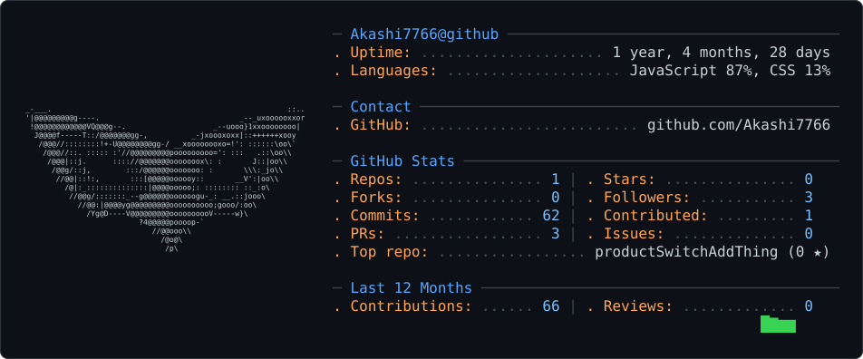

  

### About

- Building a 2D roguelike in Unity
- Mobile apps with React Native and Expo
- Working on an internship finder: scraping, placement tracking, resume parsing

### Tech

  
  
  
  
  
  
  
  
  

  
ASCII card

  <picture>
    <source media="(prefers-color-scheme: dark)" srcset="dark_mode.svg" />
    <source media="(prefers-color-scheme: light)" srcset="light_mode.svg" />
    
  </picture>

